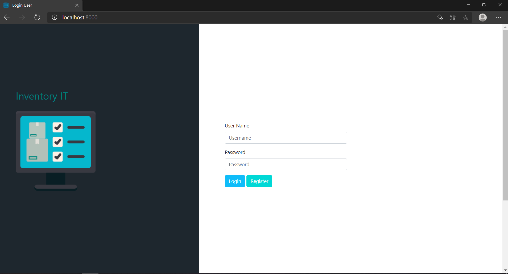
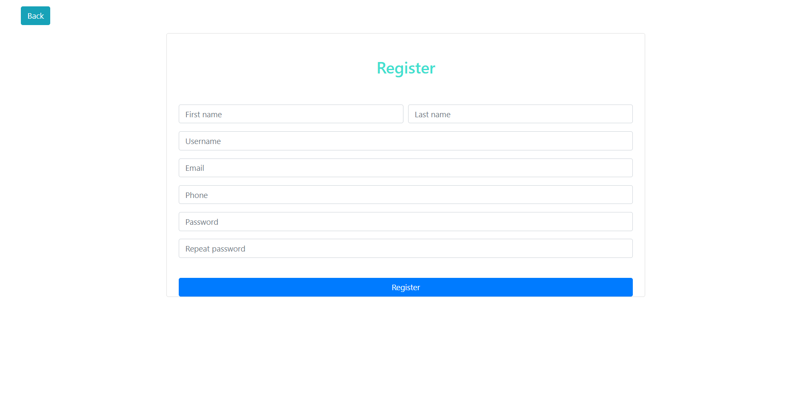
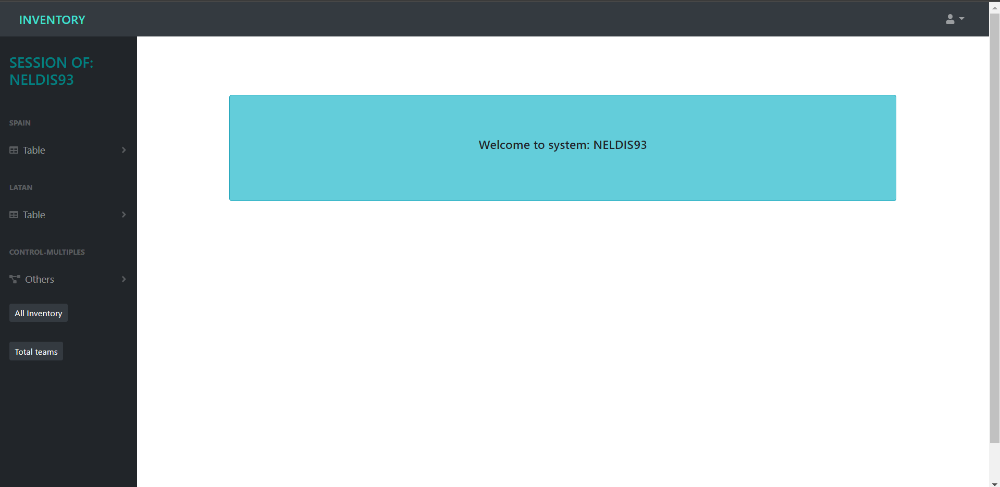
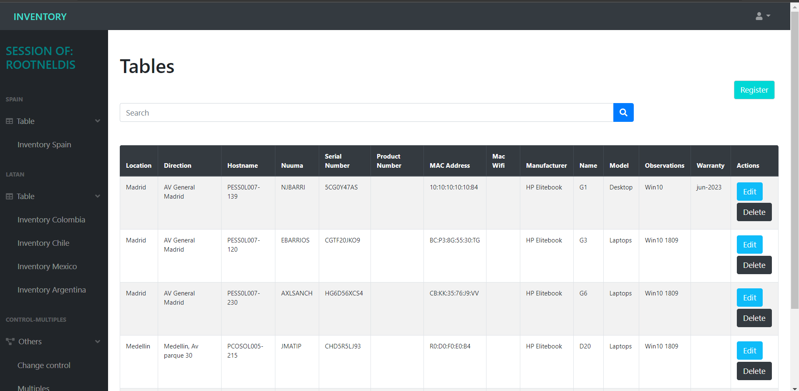
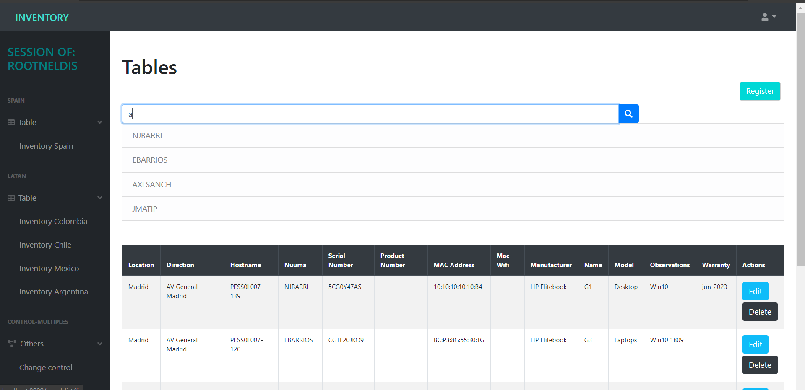

# Project Inventory :computer:

Project work for Inventory IT

# Description

This is a test project to automate an inventory of computer equipment, where it contains specifications of the equipments, change control, monitoring of the ticketing tool that I carry in my current job.

# ⚡ Used Technologies
- Django
- Django rest framework
- PostgreSQL
- Bootstrap 4
- Vuejs 

# Some images of the project :camera: 

#

#

#

#

